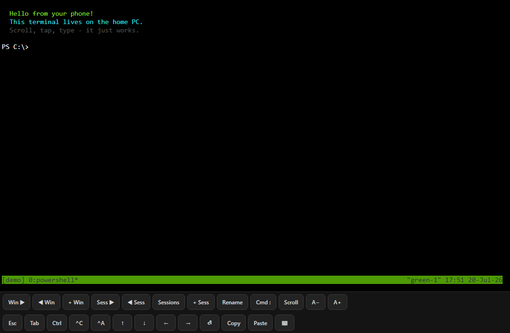
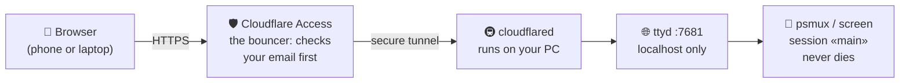
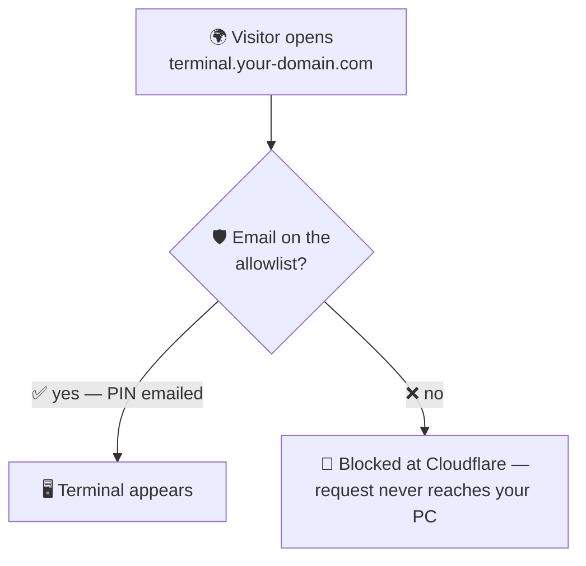
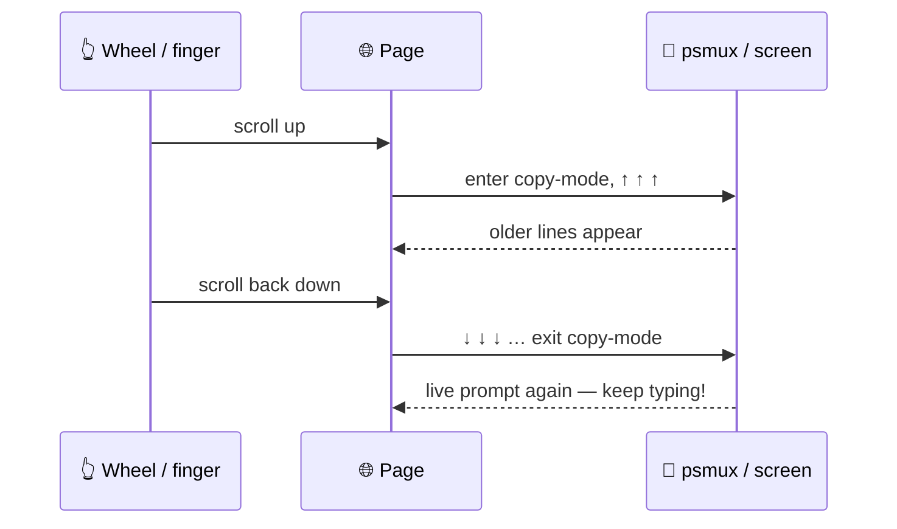

# 🖥️➡️📱 web-terminal



**Your computer's terminal, in any browser, on any device.** Open a page on your phone and you're typing into a real shell on your PC at home. Close the tab, reopen it tomorrow — everything is exactly where you left it. Works on **Windows** (with [psmux](https://github.com/psmux/psmux)) and **Linux** (with [GNU screen](https://www.gnu.org/software/screen/)).

## 🧩 How it works



| Layer | Job | Why it matters |
|---|---|---|
| 🛡️ **Cloudflare Access** | Asks "who are you?" before anything loads | Strangers are stopped at Cloudflare's servers, not yours |
| 🚇 **cloudflared tunnel** | Carries traffic from Cloudflare to your PC | No open ports on your router, no port forwarding |
| 🌐 **ttyd** | Turns a terminal into a web page | Bound to `127.0.0.1` — invisible to your network |
| 🧵 **psmux / screen** | Keeps the shell session alive forever | Refresh the page, switch devices — same session |

Every browser tab attaches to the **same** persistent session, so your phone and laptop literally look at the same screen. On Windows, a refresh reattaches to the session you were **last using** (psmux keeps a current-session pointer; `attach-web.ps1` asks for it) — and you can force one with `/?arg=<session>` in the URL.

## ⚡ Quick start

### 🪟 Windows (ttyd + psmux)

1. Install the tools: `scoop install ttyd psmux`
2. Run the launcher: `powershell -File start_web_terminal.ps1`
3. Open `http://127.0.0.1:7681` — that's your terminal 🎉

For auto-start + self-healing, create a scheduled task (at logon + every 5 min) that runs `run-watchdog-hidden.vbs` — the watchdog health-checks ttyd over HTTP, kills it if hung, and restarts the keep-alive loop if dead.

### 🐧 Linux (ttyd + GNU screen)

1. Install the tools: `sudo apt install ttyd screen` (or your distro's equivalent)
2. Make the scripts runnable: `chmod +x linux/*.sh`
3. Run the launcher: `linux/start-web-terminal.sh`
4. Open `http://127.0.0.1:7681` 🎉

To keep it running forever, install the systemd user unit:

```bash
mkdir -p ~/.config/systemd/user
cp linux/web-terminal.service ~/.config/systemd/user/
systemctl --user daemon-reload
systemctl --user enable --now web-terminal
loginctl enable-linger "$USER"   # keeps it alive when you log out
```

| | 🪟 Windows | 🐧 Linux |
|---|---|---|
| Multiplexer | psmux (prefix **Ctrl+B**) | GNU screen (prefix **Ctrl+A**) |
| Launcher | `start_web_terminal.ps1` | `linux/start-web-terminal.sh` |
| Keep-alive | scheduled task + `watchdog_web_terminal.ps1` | systemd `web-terminal.service` |
| Web page served | `ttyd-index.html` | `ttyd-index-screen.html` |
| Session config | `~/.psmux.conf` | `linux/screenrc` |

## 🌍 Putting it on the internet (Cloudflare Tunnel + Access)

The terminal only listens on `127.0.0.1`, so nobody on the internet (or even your wifi) can reach it directly. A Cloudflare tunnel makes it reachable at a hostname you own, and Cloudflare Access makes sure **only you** get in. You need a domain added to Cloudflare (free plan is fine).

1. **Create the tunnel** — In the [Cloudflare Zero Trust dashboard](https://one.dash.cloudflare.com/): **Networks → Tunnels → Create a tunnel**. Name it (e.g. `web-terminal`), then copy the one-line install command it shows you and run it on your PC. That installs `cloudflared` as a Windows service / systemd service with the tunnel token baked in — it auto-starts from then on.
2. **Point a hostname at ttyd** — In the tunnel's **Public hostname** tab, add one: subdomain `terminal`, your domain, service `HTTP` → `localhost:7681`. Now `https://terminal.your-domain.com` reaches ttyd — but don't stop here, it has **no password yet!**
3. **Lock it with Access** — **Access → Applications → Add an application → Self-hosted**. Set the domain to `terminal.your-domain.com`. Add a policy: Action **Allow**, include **Emails** = your email address. Save.
4. **Test it** — Visit your hostname from your phone. Cloudflare asks for your email, sends a one-time PIN, and only then shows the terminal. Anyone else gets a locked door. ✅



> 🔑 **Golden rules:** never run ttyd with `-i 0.0.0.0`, never port-forward 7681 on your router, and never add the tunnel hostname without an Access policy. The scripts in this repo already do the safe thing.

## 📟 The web page

The page (`ttyd-index.html` / `ttyd-index-screen.html`) is a single self-contained file served by `ttyd -I`. It's a custom [xterm.js](https://xtermjs.org) client that speaks ttyd's websocket protocol directly, built for phones:

### 🔘 The button toolbar

| Button | What it does (🪟 psmux / 🐧 screen) |
|---|---|
| `Win ▶` `◀ Win` `+ Win` | Next / previous / new window |
| `Windows` | Window chooser |
| `Ren Win` | Rename the current window |
| `Sess ▶` `◀ Sess` `Sessions` `+ Sess` `Ren Sess` | Switch, list, create, rename sessions *(psmux only)* |
| `Cmd :` | The multiplexer's command prompt |
| `Scroll` | Enter copy/scroll mode by hand |
| `A−` `A+` | Font size (remembered on your device) |
| `Esc` `Tab` `^C` `^A` `⏎` arrows | The keys mobile keyboards don't have |
| `Ctrl` | **Sticky Ctrl**: tap it, then tap any letter → Ctrl+letter |
| `Copy` `Paste` | Clipboard in and out of the terminal |
| `Copy buf` | Copy psmux's yank buffer (from Scroll-mode `y`) to the device clipboard *(psmux only)* |
| `⌨` | Reopen the mobile keyboard |

Buttons send raw byte sequences (e.g. `Ctrl+B c` for a new psmux window) straight down the websocket — no extra server, no key simulation.

### 🖱️ Scrolling that just works

Multiplexers keep history *inside themselves*, so a browser normally can't scroll it — the page just sits there. This client fixes that with a scroll bridge:



Mouse wheel, touch drag, and fling all work, with **20,000 lines** of history. If an app like `vim` or `htop` grabs the mouse itself (Linux), the wheel is passed through to it instead.

### 📋 Big copy & paste

Two Windows quirks get worked around so large text moves reliably:

- **Paste** is sent as 512-byte mini-pastes, 40 ms apart — a single big burst gets silently discarded past a few KB (and far sooner through Cloudflare). Measured lossless at 20 KB+.
- **Copy** of psmux's yank buffer can't use the standard OSC52 clipboard escape (Win10 ConPTY destroys it), so `Copy buf` runs `copybuf.ps1` in a throwaway window: it prints the buffer base64-wrapped in markers, the page fishes it out of the stream and writes your device clipboard. Flow: `Scroll` → `Space` → move → `y` → `Copy buf`.

## 🗂️ What's in the repo

| File | What it is |
|---|---|
| `start_web_terminal.ps1` | 🪟 launcher: keep-alive loop, env-var hygiene, psmux session |
| `attach-web.ps1` | 🪟 per-connection attach: lands on your last-used session |
| `copybuf.ps1` | 🪟 bridges psmux's yank buffer to the browser clipboard |
| `watchdog_web_terminal.ps1` + `run-*-hidden.vbs` | 🪟 self-healing scheduled-task pieces |
| `linux/start-web-terminal.sh` | 🐧 launcher: keep-alive loop, env-var hygiene |
| `linux/attach-main.sh` | 🐧 per-connection attach (creates session if missing) |
| `linux/screenrc` | 🐧 screen config: 20k scrollback, status bar, altscreen |
| `linux/web-terminal.service` | 🐧 systemd user unit |
| `ttyd-index.html` / `ttyd-index-screen.html` | built web pages (psmux / screen flavor) |
| `ttyd-ui/` | page sources: `client.js`, `template.html`, pinned xterm.js 5.5.0 |
| `unlock-h.ps1` `lock-h.ps1` `lock_flashdrive.ps1` `switch-to-h.ps1` | 🪟 BitLocker flashdrive helpers (see below) |

### 🔨 Rebuilding the page

Edit `ttyd-ui/client.js` (toolbar lives in `ROWS`) or `template.html`, then:

```powershell
powershell -File ttyd-ui\build.ps1     # Windows
```
```bash
linux/build.sh                          # Linux (needs python3)
```

Both build **both** flavors. ttyd re-reads the file on every page load, so just refresh the browser — no restart.

## 🔐 Security notes

| Risk | Defense |
|---|---|
| Random internet visitors | Cloudflare Access email allowlist — blocked before reaching your PC |
| Someone on your wifi | ttyd binds `127.0.0.1` only; nothing to connect to |
| Secrets in the repo | Credentials, recovery keys, and logs are gitignored; scripts contain no hostnames or passwords |
| Stolen config USB (🪟 setup) | Claude Code config lives on a BitLocker-encrypted flashdrive (`H:`), unlocked with `unlock-h.ps1` |
